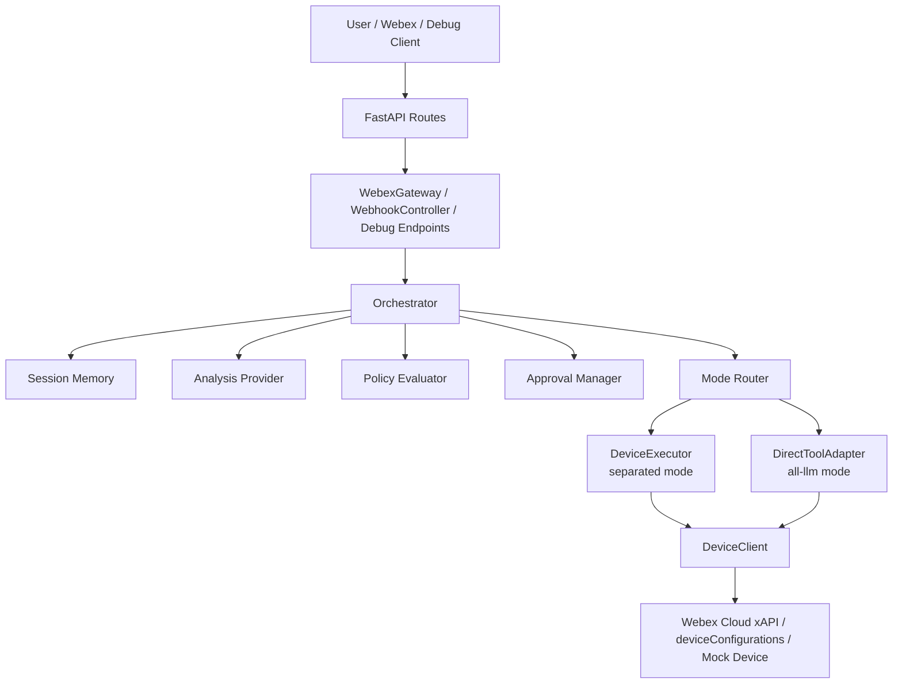
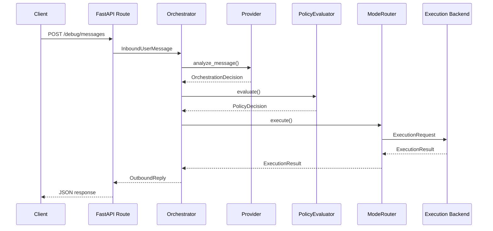

# Architecture Manual

## Purpose
This document describes the current implementation architecture of the Webex Device Assistant App, including runtime composition, module boundaries, request flow, provider design, execution modes, policy and approval handling, state boundaries, and current limits.

The project is a FastAPI application that converts natural-language requests into controlled Webex device read or control actions.

---

## System overview

### Core characteristics
- FastAPI-based API server
- Webex messaging webhook integration
- Local debug routes for development and testing
- Thin browser-based admin page
- LLM-first orchestration with structured execution contracts
- Dual execution modes: `separated` and `all-llm`
- Mock-first default behavior

### Architectural principle
The Assistant App remains the central orchestration layer in both execution modes. It is always responsible for:
- receiving user input
- interpreting intent
- collecting missing parameters
- evaluating policy
- deciding whether approval is required
- creating execution requests
- formatting the final reply

The execution mode changes only the execution backend, not the user-facing flow.

- **Separated mode** executes through `device_executor`
- **All LLM mode** executes through `direct_tool_adapter`

---

## High-level architecture

---

## Module boundaries

## `assistant_app/`
Owns the application service layer and orchestration.

### Main responsibilities
- application composition and dependency wiring
- inbound message normalization
- natural-language interpretation
- follow-up question flow
- policy evaluation
- approval creation and resolution
- routing to execution backends
- outbound reply formatting
- admin APIs and Webex integration support

### Key files
- `main.py`
  - Builds the FastAPI app
  - Loads configuration
  - Creates and wires runtime services
  - Registers routes and startup state
- `orchestrator.py`
  - Main conversation controller
  - Handles follow-up questions, pending actions, approvals, and execution dispatch
- `config.py`
  - Loads and validates env-based configuration
- `policy_evaluator.py`
  - Evaluates policy per intent and chooses mode plus approval state
- `mode_router.py`
  - Builds `ExecutionRequest` objects and routes them to the active execution backend
- `memory_store.py`
  - Stores session turns and pending follow-up actions in memory
- `webex_gateway.py`
  - Webex messaging edge for fetch, send, and card interactions
- `webhook_controller.py`
  - Signature verification, dedupe, and routing for Webex webhook flows
- `provider_registry.py`
  - Describes available providers and builds active runtime analysis providers
- `approval_manager.py`
  - Stores approval requests and resolves decisions
- `admin_service.py`, `admin_auth.py`
  - Admin settings, auth flow, and runtime control-plane operations
- `state_store.py`
  - Runtime admin state, policy overrides, approvals, audit records, provider settings

---

## `device_executor/`
Owns deterministic execution for separated mode.

### Key files
- `executor.py`
  - Enforces approval gating and supported intent checks
- `handlers.py`
  - Maps normalized requests to device operations
- `device_client.py`
  - Resolves devices and performs Webex Cloud xAPI or device-configuration operations

### Design intent
This layer does not interpret natural language. It receives already-normalized execution requests and performs deterministic device-side operations.

---

## `direct_tool_adapter/`
Owns all-LLM-mode execution bindings.

### Key files
- `adapter.py`
  - Dispatches normalized execution requests by intent
- `tools.py`
  - Thin tool set backed by the shared `DeviceClient`

### Design intent
In the current MVP, this is still deterministic request dispatch, not a fully agentic runtime. It behaves like a tool-style execution layer that can evolve later.

---

## `shared/contracts/`
Owns the canonical data contracts.

### Main contents
- `actions.py`
  - `Intent`
  - `ActionProposal`
  - per-intent parameter models
  - `PendingActionProposal`
  - `OrchestrationDecision`
- `execution.py`
  - `ExecutionRequest`
  - `ExecutionResult`
  - device and status snapshot models
- `policy.py`
  - `ExecutionMode`
  - `ApprovalState`
  - `PolicyDecision`
- `provider.py`
  - provider kinds, descriptors, capabilities, settings
- `inbound.py`
  - `InboundUserMessage`
  - `OutboundReply`
- `admin.py`, `approval.py`, `audit.py`, `conversation.py`
  - admin, approval, audit, and session models

### Design value
These contracts keep the orchestration layer and the execution layers loosely coupled and strongly typed.

---

## `admin_page/`
Owns the thin browser-based admin surface.

### Key files
- `api.py`
  - Serves `/admin-page`, docs pages, static assets, and manual downloads
- `static/index.html`
  - Main admin page shell
- `static/admin.js`
  - Client-side control logic

### Design value
The admin page is intentionally lightweight. It is a static surface backed by `/admin/*` APIs rather than a separate frontend application stack.

---

## Runtime composition
`assistant_app.main.build_app()` is the composition root.

It creates and wires:
- `AppConfig`
- `InMemorySessionStore`
- runtime state store
- `TokenManagerTokenProvider`
- `DeviceClient`
- `ExecutionHandlers`
- `DeviceExecutor`
- `DirectToolSet`
- `DirectToolAdapter`
- `ModeRouter`
- `ApprovalManager`
- `ProviderRegistry`
- `Orchestrator`
- `WebexGateway`
- `WebhookController`
- `AdminService`

This is explicit manual wiring rather than framework-heavy dependency injection.

---

## Request flow

## Debug flow

## Webex message flow
1. Webex calls `POST /webhooks/webex/messages`
2. `webhook_controller.py` verifies `X-Spark-Signature`
3. `webex_gateway.py` validates and fetches the full message by id
4. self-authored and empty messages are filtered out
5. the message becomes an `InboundUserMessage`
6. `Orchestrator` handles the request
7. the gateway sends the final reply back to Webex

## Webex card flow
### Approval cards
1. the orchestrator creates an approval request
2. Webex sends `POST /webhooks/webex/attachment-actions` when a user clicks the card
3. the server verifies the signature
4. the gateway fetches attachment action details from Webex
5. the approval manager resolves the decision
6. if approved, the orchestrator executes the attached request and sends a follow-up reply

### Entity-selection cards
When `target_device` is missing, the orchestrator may return a Webex Adaptive Card device selector instead of free text only. The selected value resumes a stored `PendingActionProposal`.

---

## Orchestrator behavior
`orchestrator.py` is the main application control point.

### Responsibilities
- append user turns
- inspect and continue pending actions
- reset session context when requested
- call the analysis provider
- ask follow-up questions for missing required fields
- create admin login approval requests
- evaluate policy and branch to approval or execution
- render the final reply text and optional markdown

### Important behavior
1. **Multi-turn slot collection**
   - If a request is missing required fields such as device name, the orchestrator stores a `PendingActionProposal` and asks for clarification.

2. **Webex card-assisted device selection**
   - In Webex contexts, missing `target_device` can be filled through an Adaptive Card selection flow.

3. **Execution result normalization**
   - Raw device results are turned into user-facing text summaries.

4. **Execution-layer decoupling**
   - The orchestrator never directly executes device calls. It delegates through `ModeRouter`.

---

## Provider architecture

## Implemented runtime analysis providers
- `rule_based`
- `ollama`

## Descriptor-only providers for now
- `openai`
- `gemini`
- `anthropic`

That means these providers appear in provider descriptors and admin data, but only `rule_based` and `ollama` are currently usable as active runtime message-analysis providers.

## RuleBasedProvider
- regex and phrase-based intent recognition
- deterministic MVP behavior
- easy to inspect and test

## OllamaProvider
- sends chat requests to Ollama
- parses returned content into structured orchestration decisions
- falls back to the rule-based provider on failure in important paths

### Architectural meaning
The system does not allow the model to bypass structure. LLM analysis is used inside a typed orchestration framework with policies and execution contracts.

---

## Execution modes

## Separated mode
Path:
`Orchestrator -> ModeRouter -> DeviceExecutor -> ExecutionHandlers -> DeviceClient`

### Characteristics
- clearer separation of responsibilities
- deterministic execution layer
- stable place for approval enforcement and handler dispatch

## All LLM mode
Path:
`Orchestrator -> ModeRouter -> DirectToolAdapter -> DirectToolSet -> DeviceClient`

### Characteristics
- tool-style execution path
- same normalized request contract
- good future path toward richer tool-calling behavior

## Shared device layer
Both execution modes ultimately use the same `DeviceClient` and therefore share the same real or mock transport capabilities.

---

## Policy and approval model

## Policy evaluation
`policy_evaluator.py` decides:
- which execution mode to use
- whether approval is required
- the policy reason string

## Approval model
Read-only actions are generally allowed without approval.
Typical examples:
- `get_status`
- `get_environment_info`
- `get_camera_mode`
- `get_room_booking`
- `list_devices`

Most mutating operations are allowed but approval-gated by default.
High-risk actions such as `reboot` and `factory_reset` are more constrained.

Approvals are stored through the runtime state store, and audit records are created for approval and control-plane changes.

---

## Device transport

## Mock path
Default settings:
- `WEBEX_MOCK_MODE=true`
- `DEVICE_MOCK_MODE=true`

This lets the app run without real Webex messaging or device credentials.

## Real path
The real execution transport is Webex Cloud xAPI plus device configuration APIs.

### Current read path
- `GET /v1/devices`
- `GET /v1/xapi/status`
- `GET /v1/deviceConfigurations`

### Current write path
- `POST /v1/xapi/command/{commandKey}`
- `PATCH /v1/deviceConfigurations`

### DeviceClient responsibilities
- device inventory lookup
- normalized device-name resolution
- status reads
- configuration reads and writes
- xAPI command execution
- mock response generation when mock mode is enabled

### Supported action areas today
- get status
- get environment info
- get camera mode
- get room booking and OBTP availability
- list devices
- Webex join
- join OBTP
- dial
- hang up
- send DTMF
- microphone mute and microphone mode
- volume
- video mute
- selfview
- camera mode (`best_overview`, `speaker_closeup`, `frames`)
- layout
- presentation
- input source switch
- matrix assign, unassign, swap
- display mode and display role
- camera preset activation
- camera position adjustment
- SpeakerTrack
- standby
- reboot
- factory reset

---

## State and persistence boundary

## In-memory only
These are process-local and reset on restart:
- session turns
- pending follow-up actions
- processed webhook event dedupe
- admin-authenticated browser sessions
- some live stats and caches

## Persisted when `ADMIN_STATE_PATH` is set
The file-backed state store persists:
- runtime admin overrides
- provider settings
- policy overrides
- approval records
- audit records

It does not persist startup secrets, webhook credentials, session memory, or dedupe state.

---

## Admin surface
The admin surface has two parts:
- `/admin/*` JSON APIs
- `/admin-page` thin browser UI

The admin page shows and edits:
- runtime settings
- startup facts
- provider settings
- action registry
- policy overrides
- organization devices
- approvals
- audit records
- runtime stats

It is a control surface, not a separate admin platform.

---

## Current strengths
1. clear separation between orchestration, policy, execution, and transport
2. mock-first development flow
3. strong typed contracts across layers
4. built-in approval model for risky actions
5. practical multi-turn follow-up support

---

## Current limitations
- no local RoomOS transport path
- runtime analysis only supports `rule_based` and `ollama`
- follow-up slot filling is partial, not universal
- some state remains process-local and not restart-safe
- camera-mode write support is intentionally conservative
- booking support focuses on read state and joinable OBTP, not booking CRUD
- the admin UI is intentionally thin

---

## Recommended next improvements
1. add real runtime support for OpenAI, Gemini, and Anthropic providers
2. reduce long manual intent mapping in request-building paths
3. separate result rendering into a presenter layer
4. add persistent session and pending-action storage
5. improve policy expressiveness by user, device, or time window
6. evolve all-LLM mode into richer tool-calling orchestration

---

## Conclusion
This project is more than a chatbot wrapper. It is an MVP orchestration platform for controlled natural-language Webex device operations.

Its strongest qualities today are:
- a stable orchestration center in `assistant_app`
- clean separation between user flow and execution backend
- safety-aware control through typed contracts and approvals

That makes it a solid base for demos, internal operations, and incremental production hardening.
