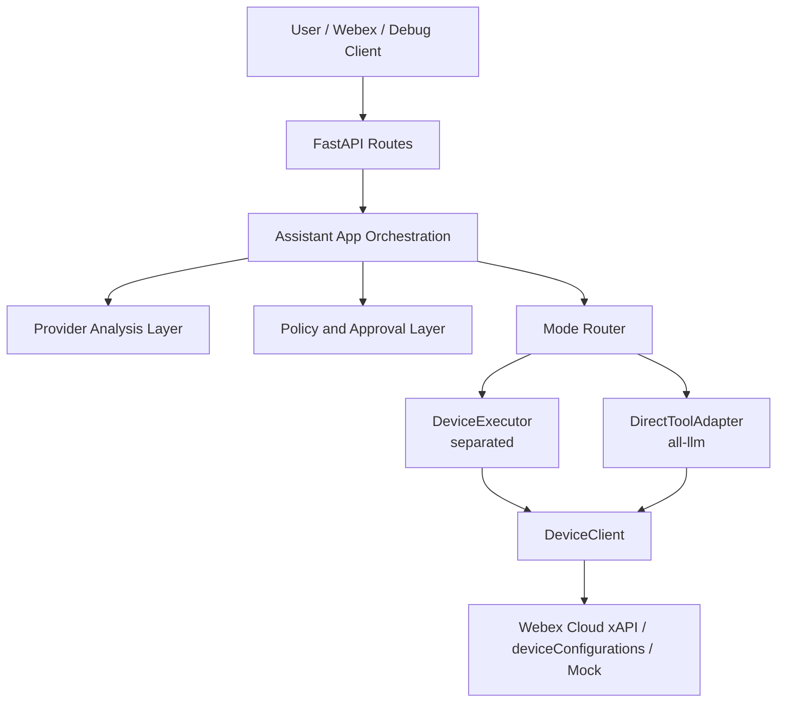

# Webex Device Assistant App

FastAPI app for a Webex Device Assistant that keeps the Assistant App as the LLM-first orchestration layer in both execution modes:

- **Separated mode** routes execution through `device_executor`
- **All LLM mode** routes execution through `direct_tool_adapter`

The repository is mock-first by default, but it already includes real Webex messaging, approval-card handling, Webex cloud xAPI device transport, and a thin browser-based admin surface.

## Architecture at a glance



## Manuals

### English
- [ARCHITECTURE.md](ARCHITECTURE.md), detailed runtime architecture, request flow, providers, execution modes, transport, persistence, and limits
- [INSTALL.md](INSTALL.md), local install, mock mode, real Webex setup, real device setup, and validation commands
- [USER_MANUAL.md](USER_MANUAL.md), daily operation guide, debug usage, approval flow, admin APIs, and troubleshooting

### Korean
- [MANUAL_KO.md](MANUAL_KO.md), Korean overview guide for architecture and operations

### Additional pointers
- [MANUAL.md](MANUAL.md), short index page for the manuals above
- `/admin-page/docs` and `/admin-page/docs-ko`, browser-served docs hubs

## Quick start

Install:

```bash
python3 -m venv .venv
.venv/bin/python -m pip install -e ".[dev]"
```

## Durable Linux service

- Checked-in unit file: [`.deploy/webex-device-assistant.service`](.deploy/webex-device-assistant.service)
- Runtime environment file: [`.deploy/webex-device-assistant.env`](.deploy/webex-device-assistant.env)
- The deployed host proxies `cisco.walcocks.com` admin and webhook paths to `127.0.0.1:8000`, so the durable service should keep this app bound there.

Run:

```bash
.venv/bin/python -m uvicorn assistant_app.main:app --reload
```

Test:

```bash
.venv/bin/python -m pytest
```

Quick smoke test:

```bash
curl -X POST http://127.0.0.1:8000/debug/messages \
  -H 'Content-Type: application/json' \
  -d '{"text":"get status of Board Pro","preferred_mode":"separated"}'
```

## Common use cases
- test natural-language device control locally through `/debug/messages`
- receive and respond to real Webex messages through webhooks
- approval-gate mutating device actions
- inspect runtime settings and policy from `/admin-page`
- switch between `separated` and `all-llm` execution modes

## Current implementation highlights
- `assistant_app` remains the orchestration center in both execution modes
- `shared/contracts` defines the canonical typed models across the app
- `rule_based` and `ollama` are the currently implemented runtime analysis providers
- device execution is mock-first by default and upgrades to Webex cloud xAPI in real mode
- state is partly persisted through the admin state store, but session and pending-action memory are still restart-local
